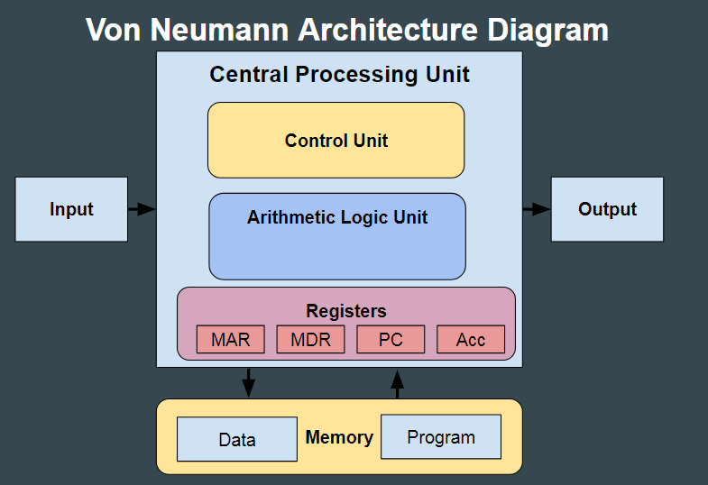

> Pietiks man te yappot

L. Seļājovs

*kr4 professors ahujena kruts*

# Datorarhitektura
[d2.lv](http://d2.lv/)
vajadzigs bus, spelite,

3dienas rits bus praktiskie

## Ieskats vēsturē
### Moore's law (Mūra likums)
Ik pēc 2 (vai 18 mēneši) gadiem tranzistori čipos dubultojas

### Datoru paaudzes
- Prims 1946 - Mehaānika, releji
- 1946 - Radio lampas
- 1959 - tranzistori
- 1965 - IC (Intehrētās shēmas)
- 1971 - VLSI (Ļoti lielas integrētās shēmas)
- 1980 - ULSI (Ultra lielas integrētās shēmas)
- ... ig kvantu datori??

1642 gads pirmā skaitīšanas mašīna (Blaise Pascal)
- Aprēķināja nodokļus

1801 gads Programmējamas stelles (Joseph-Marie Jacquard)
1822 gads Diffrence engine (Charles Babbage)
1837 gads Analytics engine (CHarles Babbage)
1937 gads Tjuringa mašīna (Alan Turing)
- Pierādīt vai ir iespējams

1938-1941 Konradzuse
- 22 biti
- motors, releji
- Aerodinamikas aprēķini

1943-1945 - ENIAC
- Modulāra
- Decimāla
- 10-digit
- 5000 operācijas/s

1943 MARK 1
- Harvarda arhitektūra (idk, some bs)
- 5hp dzinējs
- 15m sinhronstienis
- 50$k par industriālo dizainu

1945 von Neumann - arhitektūra

1952 EDVAC
- bināra
- 44bit vārdi
- Mercury delay line memory

1951 UNIVAC
- Pirmais komerciālais dators
- 46 pārdoti un katrs vismaz 1m$

1951 IBM 701
- Pirmais zinātniski komerciālais
- Atmiņa 2k x 36 biti
- 16k op/sek
- Fortan krīze

1964 IBM 360
- Bija 5 nesavienojami datoru tipi, tagad vairs it kā nav vairs tā problēma

1959 Integrētā shēma

1981 IBM PC
- CPU Intel 8088 4.77MHz
- RAM 16KB-256KB
- MS DOS

1983 IBM PC XT
- 10-20MB HD

Tirgū:
- paredzēts 250k/5gados
- reāli 250k/mēnesī

## 8 Lielās idejas
### Mūra likums
Projektē ņemot vērā Mūra likumu

### Abstrakcija
Lieto lai vienkāršotu dizainu

### Biežais ātrāk
Paātrini biežāk lietotās lietas

### Paralelā izpilde
Uzlabo veiktspēju ar paralēlu izpildi

### Konveijera princips
Uzlabo veiktspēju ar konveijera pricipu

### Paredzēšana
Uzlabo veiktspēju ar paredzēšanu

### Atmiņu hierarhija
uzlabo veiktspēju ar atmiņas hierarhiju

### Uzticimīiva ar rezervi
Uzlabo uzticamību, drošumu ar papildus rezervēm

## Zem vāka

