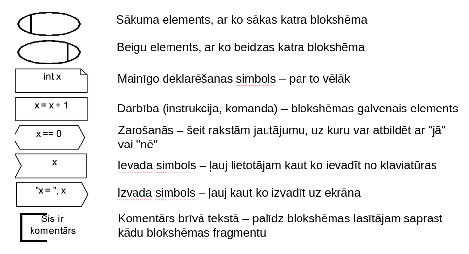
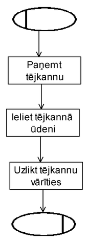
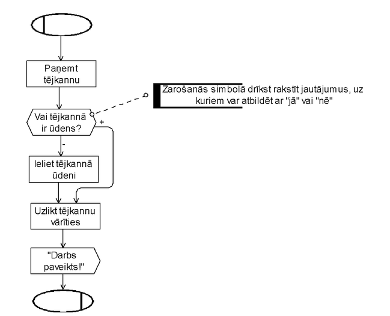
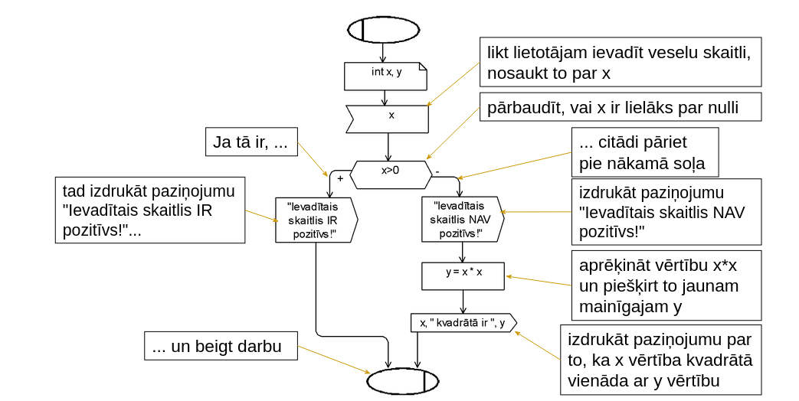

# Rencis
## INFO
### **15 praktiskie darbi**
- teorijas atkartosana/apguve
- uzddevumu risinājumu piemēri
- patstāvīga uzdevuma risināšana
- uzdevumu risināšana "pie tafeles"

te bus uz papira

### **2 kontoldarbi**
- KD1 8-9 oktobris
- KD2 19-20 novembris

### Info par KD
- 90 min
- viena A4 lapa
- nevar datorus izmantot
- pie tāfeles dod punktus

**viss info ir [estudijas](https://estudijas.lu.lv/)**

## Algoritms un blokshēmas

Programmēšana - instrukciju sastādīšana datoram saprotamā valodā noteikta uzdevuma veikšanai
- bassicly algoritms

### veidi

Algoritmu var uzdot (pierakstīt dažādos veidos)
1. dabīgā valodā
- iztāstam pa soļiem. kas jādara - visprims darām to, pēc tam to utt.
2. grafisku diagrammu veidā
- iepriekš norunārtā vienošanās par katra grafiskā simbola nozīmi
3. Programmēšanas valodā
- stingri noteiktas ko mandas ar iepriekš zināmu nozīmi
- tāpat kā dabīgās valodas, arī programmēšanas valodas ir dažāds - tajāsir dažādas komandas (apskatīsies python un c++)

### grafiskā (blokshēmu) / darbības


### veidošana
#### uzd. uzvārīt tēju
##### valoda
1. paņemt tējkaņu
2. ielikt  tējkannā ūdeni 200 ml
3. uzlikt tējkannu vārīties

##### blokshēma


bet te problēmas, piem:
- ja ūdens jau ir

##### part 2 labots
1. paņemt tējkannu
2. ja tējkannā nav ūdens, tad ieliet tējkannā ūdeni, citādi šajā solī nedarīt neko
3. uzlikt tējkannu vārīties

**Visus blakus apstākļus nekad nevarēs ņemt vērā, bet jācenšas ņemt vērā būtiskākos** 
- var nebūt pašas tējkannas
- var būt atslēgta ūdens padeve
- var nebūt, kur likt ūdeni vārīties



### Mainīgie
**Mainīgie** - jau no matemātikas pazīstamss jēdziens
1. to indentificē tā vārds
2. mainīgais var pieņemt dažādas vērtībaaas
- mainīgā vērtību var ievadīt lietotājs
- mainīgajam vērtību var piešķirt kādā no algoritma darbībām
- citu veidu, kā mainīgais var iegūt jaunu vērtību, nav!
3. katrs mainīgais pirms lietošanas ir **jādeklarē**
- deklarēt – norādīt, kāda veida vērtības mainīgais drīkstēs pieņemt (norādīt mainīgā tipu): int, string, char, bool, double.
4. Divas svarīgas lietas par mainīgajiem
- pirms izmantošanas mainīgais ir jādeklarē
- pirms mainīgā vērtības lietošanas mainīgajam ir jābūt piešķirtai vērtībai (vienā no diviem iespējamajiem veidiem)

Mainīgie blokshēmās
1. Mainīgo deklarācijas simbols
- mainīgo var deklarēt (int x, double y)
2. Ievada simbols
- mainīgā vērtību var likt ievadīt lietotājam no klaviatūras (x)
3. Darbības simbols
- mainīgajam var piešķirt vērtību (x = 17)
- mainīgā vērtību var piešķirt citam (vai tam pašam mainīgajam) (y = x y = x+5 x = x+1)
4. Izvades simbols
- mainīgā vērtību var izvadīt uz ekrāna (x "x = ", x x+5)
5. Zarošanās simbols
- par mainīgā vērtību var uzdot jautājumu, uz kuru var atbildēt ar "jā" vai "nē" (x == 0 x > 17 x + 5 <= y * 3)

### Sakarīgas blokshēmas
Uzdevums
- Lietotājs ievada veselu skaitli. Noskaidrot, vai ievadītais skaitlis ir pozitīvs vai nav. Ja tas nav pozitīvs, aprēķināt un izvadīt arī šī skaitļa kvadrātu.

Par formulējumu...
- ja teikts "noskaidrot", "aprēķināt" u. tml., tas nozīmē, ka atbilde uz šo jautājumu jāpaziņo lietotājam (tas ir, jāizdrukā uz ekrāna)

Grūtākā lieta – izdomāt algoritmu dabīgā valodā
- likt lietotājam ievadīt veselu skaitli, nosaukt to par x
- pārbaudīt, vai x ir lielāks par nulli (ja tā ir, tad izdrukāt paziņojumu "Ievadītais skaitlis IR pozitīvs!" un beigt darbu, citādi pāriet pie nākamā soļa)
- izdrukāt paziņojumu "Ievadītais skaitlis NAV pozitīvs!"
- aprēķināt vērtību x*x un piešķirt to jaunam mainīgajam y
- izdrukāt paziņojumu par to, ka x vērtība kvadrātā vienāda ar y vērtību

Atlicis vieglākais – pārtulkot šo algoritmu blokshēmu valodā



### Uzdevums1
Lietotājs ievada 3 veselus skaitļus. Noskaidrot, vai eksistē trijsturis ar šadiem malu garumiem.
```
ievada int x, y, z
bool x1, y1, z1

Veic darbību x <= y + z
- true x1 = true
- false x1 = false

Veic darbību y <= x + z
- true y1 = true
- false y1 = false

Veic darbību z <= y + z
- true z1 = true
- false z1 = false

pārbauda x1 = true | y1 = true | z1 = true
- true var izveidot
- false nevar izveidot
beigas japartaisa
```
(uztaisit ka blokshemu velak)

### Uzdevums 2
Lietotājs ievada 3 veselus skaitļus a, b, c. aprēķinātun izvadīt izteiksmju x=-b/(2<sup>a</sup>) un y=ax<sup>a</sup>+bx+c
``` 
idk man man galags
galvenais double izmantot nevis int
```

### Cikli
Atkārtojas viens un tas pats vairākas reizes

## 2. stunda
kinda stāsta basic shit par c++ un python
``` cpp
cout << "izvade";
cin >> ievade;
```
